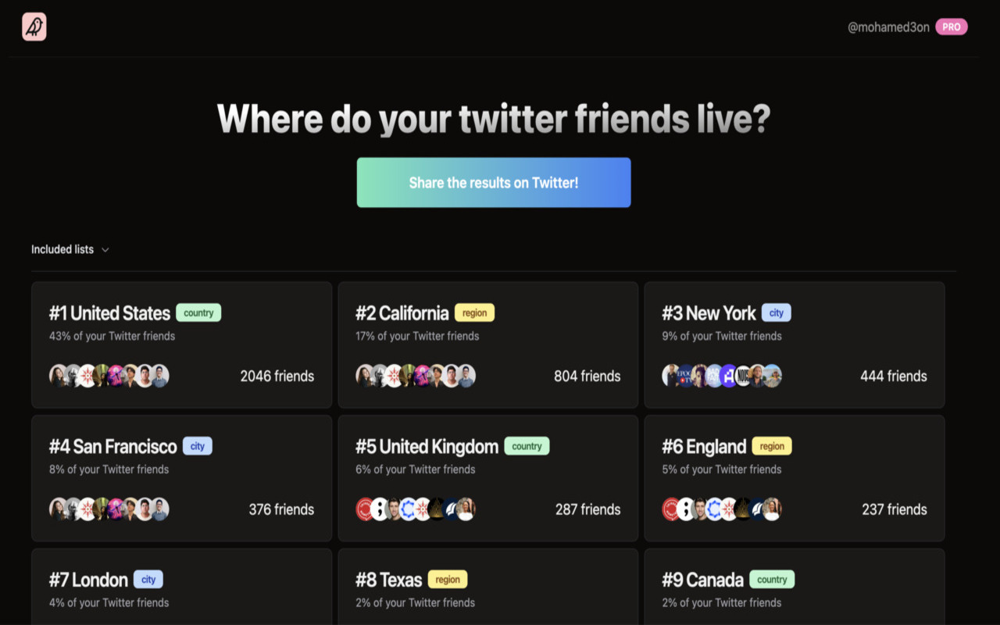

# Tribe Finder

Inspired by [Smallworld](https://github.com/devonzuegel/smallworld) which no longer works
due to Twitter API changes, [Tribe Finder](https://tribefinder.app) is a 100% free and working Chrome extension that helps you find out where your Twitter friends are
based.

It's a great way to find out where your friends are located, and to get inspiration for
cities to live in.

## Installation

You can install the extension from the Chrome Web Store at https://tribefinder.app

## Features

- Get inspirations for cities to live in, with recommendations based on your own community.
- Find friends to meet up with when travelling.
- See sunshine hours for the cities where your friends live.
- Include members of your Twitter Lists in your tribe.
- No Twitter Login required.
- Totally private, your data is stored locally.
- You can run it for any twitter profile, not just your own.

## Limitations:

- Only works for public Twitter profiles
- Only shows locations with at least 2 friends in them
- Only counts friends who have a valid location in their Twitter profile

## How it works

When the user enters their Twitter username, we run open a Twitter page and run a couple of API
requests to get the user's friends and lists. We then geocode the clean up the location data using a
bunch of regex magic, and feed those into Mapbox's Geocoding API to get the details of the each
location (city, country, etc).

We then aggregate the data and show the user a sorted list of countries/cities where their friends
are based.

\*Note: The list is inclusive, so if a friend is based in "New York, NY, USA", they will be
counted towards both "New York" and "USA".

## Local development

1. Clone the repository
2. Run `bun install`
3. Run `bun run dev` to start the development server
4. Go to `chrome://extensions/` in your browser
5. Enable developer mode
6. Click on `Load unpacked` and select the `out` folder
7. The extension should now be installed, you can open it by clicking on the extension icon in the top right corner of your browser

## Tech Stack

- Next.js (static export)
- TypeScript
- Tailwind CSS
- Shadcn UI
- react-hook-form
- Unofficial Twitter API (don't tell elon)

## Read More

If you're interested in why I built Tribe Finder, I wrote about it [here](https://www.mohamed3on.com/tribe-finder/)
